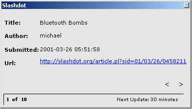



## Slashdot News Reader

### Description

This is a small utility that connects to Slashdot.org and retrieves the most current articles. The GUI allows you to scroll throw the articles and if you want to read one you just click on the url. This example uses Microsoft's XML Parser v2.0
 
### More Info
 

             |
---                |---
**Submitted On**   |2001-03-26 08:11:42
**By**             |[fishoutawata](https://github.com/Planet-Source-Code/PSCIndex/blob/master/ByAuthor/fishoutawata.md)
**Level**          |Advanced
**User Rating**    |4.6 (23 globes from 5 users)
**Compatibility**  |VB 6\.0
**Category**       |[Internet/ HTML](https://github.com/Planet-Source-Code/PSCIndex/blob/master/ByCategory/internet-html__1-34.md)
**World**          |[Visual Basic](https://github.com/Planet-Source-Code/PSCIndex/blob/master/ByWorld/visual-basic.md)
**Archive File**   |[CODE\_UPLOAD175923262001\.zip](https://github.com/Planet-Source-Code/fishoutawata-slashdot-news-reader__1-21937/archive/master.zip)

